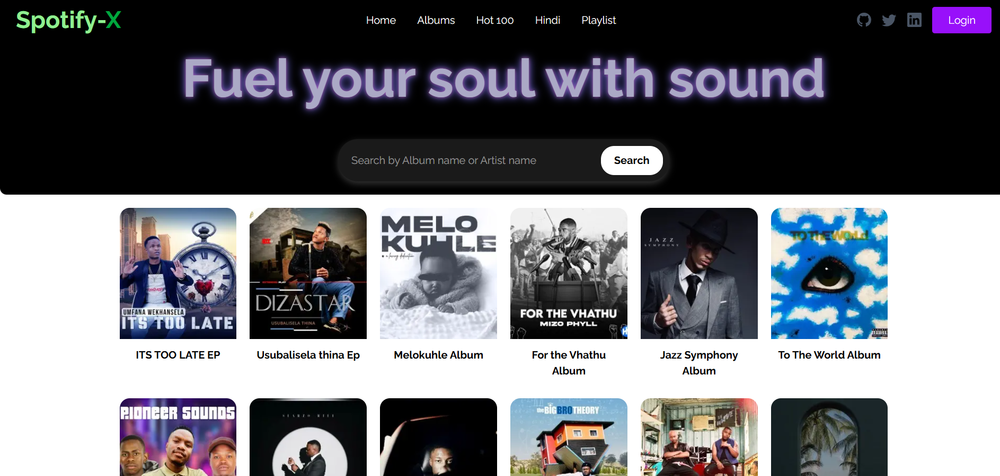
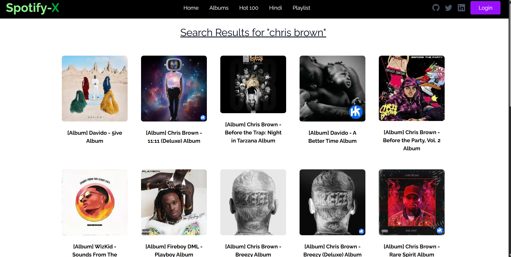
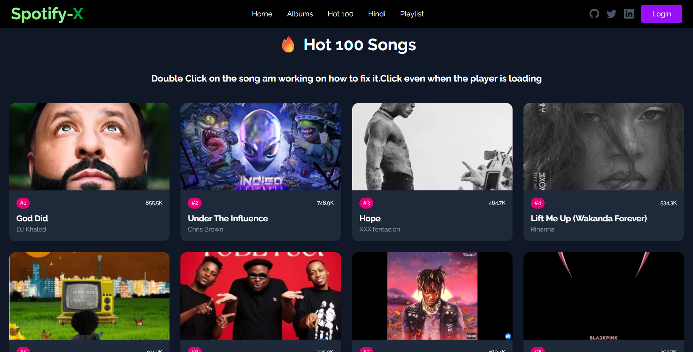
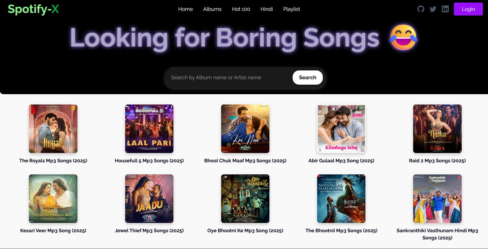

# 🎵 Sonic-waves — A Stylish Music Player Web App

Sonic-Waves is a futuristic, neon-styled music player built with Next.js 15, PostgreSQL, and Prisma. It offers a sleek and immersive user experience with glowing UI elements, smooth transitions, and essential music features like play, pause, shuffle, and repeat.

This project is perfect for music lovers who want a visually appealing and fully functional music streaming experience on the web.

---

## 🚀 Features

- 🎧 **Modern Music Player** — With controls like Play, Pause, Next, Previous.
- 🌌 **Stylish Neon Design** — Inspired by space and neon themes.
- 🔁 **Repeat One Mode** — Toggle repeat for a single track.
- 🔀 **Shuffle Toggle** — Shuffle songs without immediate jump.
- 📶 **Volume & Seek Bar** — Adjust volume and scrub through tracks.
- 📍 **Fixed Player** — Beautifully docked at the bottom-left of the page.
- 🎚️ **Global Context** — Persistent playback across route navigation.
- 🧠 **Smart Playlist Logic** — Continue where you left off.
- 🔍 **Search for Artists & Albums** — Dynamic album explorer.
- 📱 **Responsive Design** — Optimized for mobile, tablet, and desktop.
- 🧩 **Expandable UI** — Built to scale with playlists, themes, and more.

---

## 🛠️ Tech Stack

- **Framework:** [Next.js 15](https://nextjs.org/)
- **Database:** PostgreSQL (via [Prisma ORM](https://www.prisma.io/))
- **Styling:** Manual CSS + Tailwind (Hero UI components)
- **State Management:** React Context API
- **Deployment:** Vercel (or your preferred platform)

---

## 📸 Screenshots

> Add screenshots here when you’re ready!

> 
